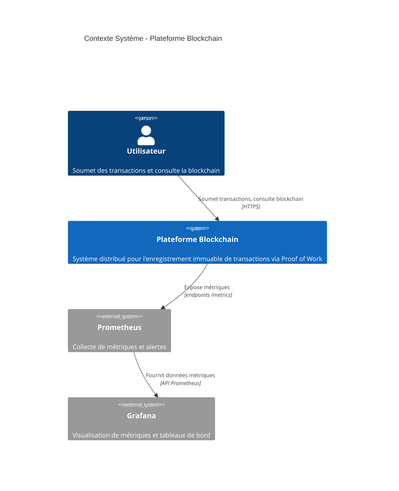

# C4 Niveau 1 : Diagramme de Contexte Système

## Objectif

Montre la vue d'ensemble : qui utilise le système et avec quels systèmes externes il interagit.

**Audience :** Tout le monde (parties prenantes techniques et non-techniques)

---

## Diagramme

---

## Acteurs

### 1. Utilisateur (Personne)

**Rôle :** Utilisateur final interagissant avec la blockchain

**Actions :**
- S'authentifie via JWT (`POST /auth/login`)
- Soumet des transactions (`POST /transactions`)
- Consulte l'historique des transactions (`GET /transactions`)
- Consulte la blockchain (`GET /blocks`)

**Accès :** Navigateur web ou client API (curl, Postman)

---

### 2. Plateforme Blockchain (Système)

**Rôle :** Système principal contenant tous les microservices et l'infrastructure

**Responsabilités :**
- Traiter les transactions via Proof of Work
- Stocker les données blockchain de manière immuable
- Exposer une API publique pour la consultation de la blockchain
- Garantir l'intégrité des données (ACID)

**Technologie :** Microservices Rust sur Kubernetes

---

### 3. Prometheus (Système Externe)

**Rôle :** Collecte de métriques et monitoring

**Actions :**
- Scrape les endpoints `/metrics` de tous les services (toutes les 15 secondes)
- Stocke les données de métriques en séries temporelles
- Déclenche des alertes selon des seuils définis
- Fournit les données à Grafana

**Accès :** Réseau interne (non exposé aux utilisateurs)

---

### 4. Grafana (Système Externe)

**Rôle :** Visualisation de métriques

**Actions :**
- Interroge Prometheus pour les données de métriques
- Affiche des tableaux de bord personnalisés
- Visualise la santé et les performances du système
- Surveillé par l'équipe DevOps

**Accès :** Réseau interne (accès DevOps uniquement)

---

## Interactions Clés

| De | Vers | Objectif | Protocole | Fréquence |
|------|----|---------|---------|-----------| 
| Utilisateur | Plateforme Blockchain | Soumettre/consulter transactions | HTTPS/REST | À la demande |
| Plateforme Blockchain | Prometheus | Exposer métriques | HTTP (pull) | Toutes les 15s |
| Prometheus | Grafana | Fournir données métriques | API Prometheus | Au rafraîchissement du dashboard |

---

## Périmètre du Système

### À l'intérieur du système
- API Gateway
- Miner Service
- Node Service
- PostgreSQL
- RabbitMQ

### À l'extérieur du système
- Utilisateur (humain)
- Prometheus (monitoring externe)
- Grafana (visualisation externe)

---

## Références

- [Modèle C4 - Contexte Système](https://c4model.com/#SystemContextDiagram)
- [Syntaxe Mermaid C4](https://mermaid.js.org/syntax/c4.html)
