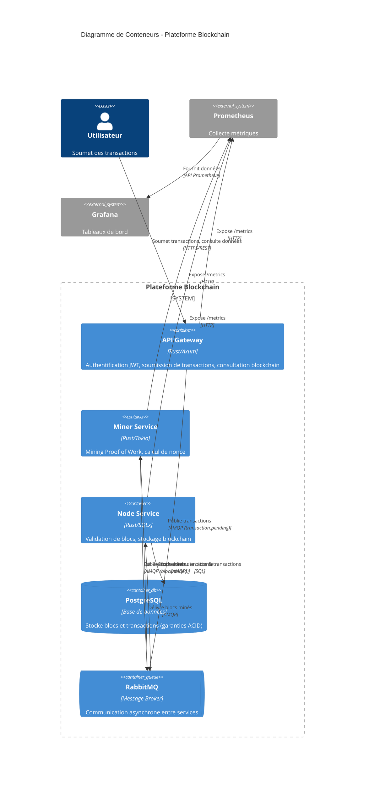

# C4 Niveau 2 : Diagramme de Conteneurs

## Objectif

Montre les choix technologiques de haut niveau et comment les conteneurs (applications, bases de données, message brokers) communiquent entre eux.

**Audience :** Parties prenantes techniques (développeurs, DevOps, architectes)

---

## Diagramme



---

## Description des Conteneurs

### 1. API Gateway

**Technologie :** Rust avec framework web Axum

**Port :** 8080

**Responsabilités :**
- Authentification JWT (`POST /auth/login`)
- Soumission de transactions (`POST /transactions`)
- Consultation de transactions (`GET /transactions`)
- Consultation de la blockchain (`GET /blocks`)
- Health checks (`/health`, `/ready`)
- Exposition de métriques (`/metrics`)

**Dépendances :**
- RabbitMQ (publie dans la queue `transaction.pending`)

---

### 2. Miner Service

**Technologie :** Rust avec runtime asynchrone Tokio

**Port :** 8081

**Responsabilités :**
- Consommer les transactions depuis RabbitMQ (queue `transaction.pending`)
- Calculer le Proof of Work (hashing SHA-256)
- Trouver un nonce valide pour la difficulté cible
- Publier les blocs minés dans RabbitMQ (queue `block.mined`)
- Health checks et métriques

**Dépendances :**
- RabbitMQ (consomme `transaction.pending`, produit `block.mined`)

**Algorithme clé :**
```rust
loop {
    nonce += 1;
    hash = SHA256(block_header + nonce);
    if hash.starts_with("0000") { // difficulté = 4
        break; // Bloc valide trouvé
    }
}
```

---

### 3. Node Service

**Technologie :** Rust avec SQLx (client PostgreSQL asynchrone)

**Port :** 8082

**Responsabilités :**
- Consommer les blocs minés depuis RabbitMQ (queue `block.mined`)
- Valider l'intégrité des blocs (chaînage de hash, difficulté)
- Stocker les blocs validés dans PostgreSQL
- Exposer la blockchain pour consultation (`GET /blocks/{hash}`, `GET /transactions/{hash}`)
- Health checks et métriques

**Dépendances :**
- PostgreSQL (stockage des blocs et transactions)
- RabbitMQ (consomme la queue `block.mined`)

---

### 4. PostgreSQL

**Technologie :** PostgreSQL 16+

**Port :** 5432

**Responsabilités :**
- Stockage persistant des blocs et transactions
- Garanties ACID (critique pour l'intégrité blockchain)
- Application de l'immuabilité via triggers
- Requêtes indexées pour recherches rapides

**Schéma :**
- Table `blocks` (block_hash, previous_hash, nonce, difficulty, timestamp)
- Table `transactions` (tx_hash, sender, recipient, amount, status)
- Clé étrangère : `transactions.block_id → blocks.id`
- Triggers : Empêchent les opérations DELETE (immuabilité)

---

### 5. RabbitMQ

**Technologie :** RabbitMQ 3.x (protocole AMQP)

**Ports :** 5672 (AMQP), 15672 (interface de gestion)

**Responsabilités :**
- Routage asynchrone de messages entre services
- Queue `transaction.pending` (API Gateway → Miner)
- Queue `block.mined` (Miner → Node)
- Persistance des messages (survit au redémarrage du broker)

**Configuration :**
- Queues durables (messages persistés sur disque)
- Acquittement manuel (garantit le traitement)

---

## Patterns de Communication

### Pattern 1 : Soumission de Transaction (Asynchrone)

```
Utilisateur → API Gateway → RabbitMQ (transaction.pending)
                          → Miner Service → RabbitMQ (block.mined)
                                          → Node Service → PostgreSQL
```

**Type :** Event-driven, cohérence à terme (eventually consistent)

**Pourquoi asynchrone ?** Le mining prend du temps (PoW), l'utilisateur ne doit pas attendre.

---

### Pattern 2 : Consultation Blockchain (Synchrone)

```
Utilisateur → API Gateway → (redirige vers) → Node Service → PostgreSQL
```

**Type :** Requête-réponse, synchrone

**Pourquoi synchrone ?** L'utilisateur attend une réponse immédiate pour les consultations.

---

### Pattern 3 : Collecte de Métriques (Pull)

```
Prometheus → (scrape /metrics) → API Gateway
                                → Miner Service
                                → Node Service
```

**Type :** Monitoring pull-based (Prometheus scrape toutes les 15s)

---

## Flux Complet de Données

### 1. Soumission d'une Transaction

```
1. User appelle POST /transactions (API Gateway)
2. API Gateway publie dans transaction.pending (RabbitMQ)
3. Miner Service consomme transaction.pending
4. Miner Service calcule PoW (boucle SHA-256)
5. Miner Service publie dans block.mined (RabbitMQ)
6. Node Service consomme block.mined
7. Node Service valide le bloc
8. Node Service stocke dans PostgreSQL
```

**Temps total :** Variable (dépend de la difficulté du PoW)

---

### 2. Consultation de la Blockchain

```
1. User appelle GET /blocks (API Gateway)
2. API Gateway interroge Node Service (HTTP interne)
3. Node Service interroge PostgreSQL (SQL)
4. Réponse remontée à l'utilisateur
```

**Temps total :** < 100ms (lecture optimisée)

---

## Références

- [Modèle C4 - Diagramme de Conteneurs](https://c4model.com/#ContainerDiagram)
- [Patterns Microservices](https://microservices.io/patterns/index.html)
- [Twelve-Factor App](https://12factor.net/)
