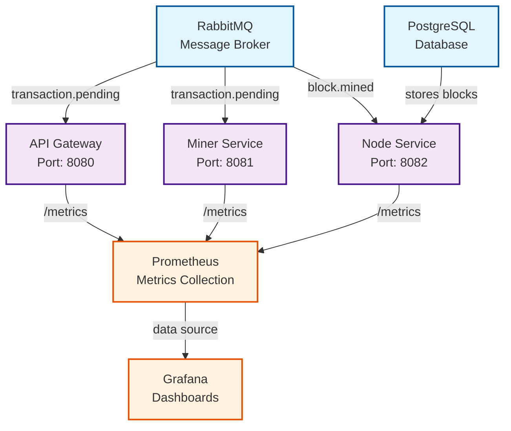

# Dependency Graph (DAG) - Deployment Order

This document describes the deployment dependencies between all components of the blockchain microservices platform.

## Purpose

The Dependency Graph (DAG - Directed Acyclic Graph) defines:
1. **Deployment order** - Which components must be deployed first
2. **Single points of failure** - Critical dependencies that can break the system
3. **Parallel deployment opportunities** - Components that can start simultaneously

---

## Dependency Diagram



---

## Deployment Levels

### Level 0: Infrastructure (Stateful Services)

**Components:**
- **PostgreSQL** - Persistent storage for blockchain data
- **RabbitMQ** - Message broker for asynchronous communication

**Deployment order:** Can be deployed in parallel (no dependencies between them)

**Critical:** These are single points of failure. If they go down, the entire system stops.

**Mitigation strategies:**
- PostgreSQL: Master-slave replication
- RabbitMQ: Cluster with 3 nodes (quorum)

---

### Level 1: Application Services

**Components:**
- **API Gateway** (depends on: RabbitMQ)
- **Miner Service** (depends on: RabbitMQ)
- **Node Service** (depends on: PostgreSQL + RabbitMQ)

**Deployment order:** Can be deployed in parallel once Level 0 is ready.

**Communication flow:**
```
User → API Gateway → RabbitMQ (transaction.pending)
                   → Miner Service → RabbitMQ (block.mined)
                                   → Node Service → PostgreSQL
```

**Key insight:** Services communicate **indirectly** via RabbitMQ, so they don't depend on each other at startup.

---

### Level 2: Observability (Optional)

**Components:**
- **Prometheus** (depends on: all application services for `/metrics` endpoints)
- **Grafana** (depends on: Prometheus as data source)

**Deployment order:** Deploy after application services are running.

**Note:** Prometheus can start before services (it will wait for them to be ready).

---

## Deployment Sequence (Production)

### Step 1: Infrastructure
```bash
# Deploy PostgreSQL
kubectl apply -f infrastructure/postgresql/

# Deploy RabbitMQ
kubectl apply -f infrastructure/rabbitmq/

# Wait for readiness
kubectl wait --for=condition=ready pod -l app=postgresql --timeout=300s
kubectl wait --for=condition=ready pod -l app=rabbitmq --timeout=300s
```

### Step 2: Application Services
```bash
# Deploy all services in parallel (they're independent)
kubectl apply -f services/api-gateway/
kubectl apply -f services/miner-service/
kubectl apply -f services/node-service/

# Wait for readiness
kubectl wait --for=condition=ready pod -l app=api-gateway --timeout=120s
kubectl wait --for=condition=ready pod -l app=miner-service --timeout=120s
kubectl wait --for=condition=ready pod -l app=node-service --timeout=120s
```

### Step 3: Observability
```bash
# Deploy Prometheus
kubectl apply -f observability/prometheus/

# Deploy Grafana
kubectl apply -f observability/grafana/
```

---

## Single Points of Failure (SPOF)

### Critical Dependencies

| Component | SPOF | Impact if down | Mitigation |
|-----------|------|----------------|------------|
| PostgreSQL | YES | Blockchain unreadable, no new blocks stored | Master-slave replication + automated failover |
| RabbitMQ | YES | Transactions stuck, no mining | RabbitMQ cluster (3 nodes) + mirrored queues |
| API Gateway | NO | Users can't submit transactions, but system continues | Horizontal scaling (3+ replicas) |
| Miner Service | NO | No new blocks, but existing data accessible | Horizontal scaling (multiple miners) |
| Node Service | NO | Blocks not stored, but mining continues | Horizontal scaling (3+ replicas) |

---

## Health Check Dependencies

Each service's `/ready` endpoint checks its dependencies:

**API Gateway:**
```yaml
readinessProbe:
  httpGet:
    path: /ready
  # Checks: RabbitMQ connection
```

**Miner Service:**
```yaml
readinessProbe:
  httpGet:
    path: /ready
  # Checks: RabbitMQ connection
```

**Node Service:**
```yaml
readinessProbe:
  httpGet:
    path: /ready
  # Checks: PostgreSQL connection + RabbitMQ connection
```

**Why this matters:** Kubernetes won't route traffic to a service until its readiness probe passes.

---

## Rollout Strategy

### Safe Update Order (Zero Downtime)

1. **Update infrastructure (PostgreSQL/RabbitMQ):**
   - Rolling update with max unavailability = 0
   - Test on staging first

2. **Update application services:**
   - API Gateway first (least critical for data consistency)
   - Miner Service second
   - Node Service last (most critical - handles storage)

3. **Update observability:**
   - Prometheus + Grafana (no impact on application)

---

## Dependency Matrix

|                | PostgreSQL | RabbitMQ | API Gateway | Miner Service | Node Service |
|----------------|------------|----------|-------------|---------------|--------------|
| **API Gateway**    | -          | ✓        | -           | -             | -            |
| **Miner Service**  | -          | ✓        | -           | -             | -            |
| **Node Service**   | ✓          | ✓        | -           | -             | -            |
| **Prometheus**     | -          | -        | ✓           | ✓             | ✓            |
| **Grafana**        | -          | -        | -           | -             | -            |

✓ = Direct dependency (must be running before startup)

---

## References

- [Kubernetes Deployment Strategies](https://kubernetes.io/docs/concepts/workloads/controllers/deployment/)
- [DAG Topological Sort](https://en.wikipedia.org/wiki/Topological_sorting)
- [RabbitMQ Clustering](https://www.rabbitmq.com/clustering.html)
- [PostgreSQL High Availability](https://www.postgresql.org/docs/current/high-availability.html)
