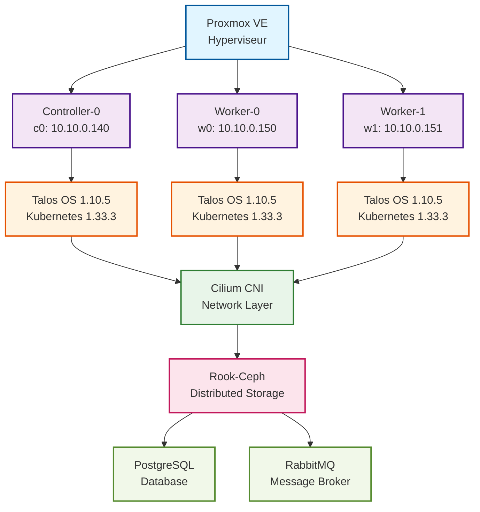

# Infrastructure Deployment Graph

## Ordre de déploiement

## Niveaux de déploiement

### Niveau 0: Hyperviseur
**Proxmox VE 8.x**
- Virtualisation hardware
- API pour automation Terraform

### Niveau 1: VMs
**3 nodes Kubernetes**
- 1 controller (c0): Control plane
- 2 workers (w0, w1): Workloads
- Configuration: 6 vCPU / 12 GB RAM / worker
- Disques: 30 GB système + 40 GB storage

### Niveau 2: OS
**Talos Linux 1.10.5**
- OS immutable API-first
- Kubernetes 1.33.3 intégré
- Pas de SSH, configuration déclarative

### Niveau 3: Réseau
**Cilium CNI**
- Network policies eBPF
- LoadBalancer L2
- Hubble observability

### Niveau 4: Stockage
**Rook-Ceph**
- 2 monitors Ceph (mon-a, mon-b)
- 2 OSDs sur /dev/sdb
- StorageClass: ceph-block (default)
- Réplication: 2x

### Niveau 5: Applications
**PostgreSQL et RabbitMQ**
- PostgreSQL: Base de données blockchain
- RabbitMQ: Message broker async

## Temps de déploiement

| Phase | Durée | Outil |
|-------|-------|-------|
| VMs | 3 min | Terraform |
| Talos bootstrap | 2 min | Terraform + Talos provider |
| Cilium install | 1 min | Helm via Terraform |
| Rook-Ceph | 5 min | Helm |
| **Total** | **~11 min** | Automation complète |

## Single Points of Failure

| Composant | SPOF | Mitigation |
|-----------|------|------------|
| Proxmox | OUI | Proxmox cluster (3+ nodes) |
| Controller-0 | OUI | 3 controllers (HA) |
| Rook-Ceph | NON | Réplication 2x |
| Cilium | NON | DaemonSet (tous nodes) |

## Références

- [Talos Installation](https://www.talos.dev/v1.10/introduction/getting-started/)
- [Rook-Ceph Quickstart](https://rook.io/docs/rook/latest/Getting-Started/quickstart/)
